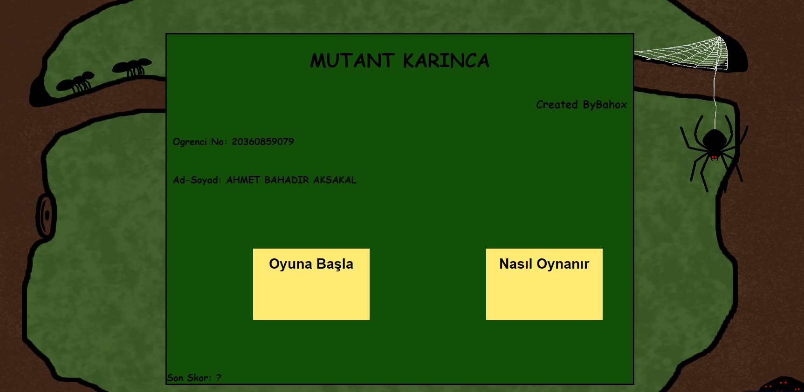
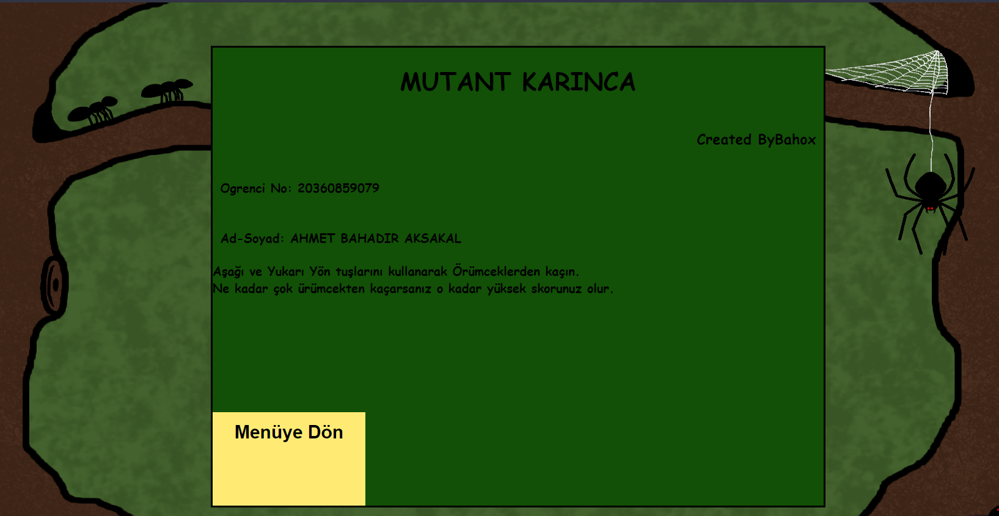
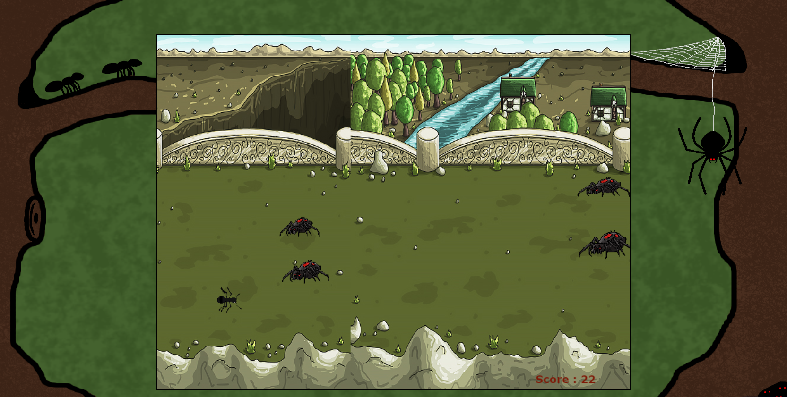

# 2. Sınıf Bahar Dönemi Wep Programlama Projem: MutantKarınca

<h3 align="center" color="Darkblue">Ahmet Bahadır Aksakal</h3>
<h4 align="center" color="Darkblue">20360859079</h4>
<h5 align="center" color="Darkblue">2. Sınıf Bahar Dönemi Web Programlama Proje Ödevim</h5>
<h6 align="center" ><a href="http://bahadr-aksakal-web-programlama-p.eu5.org/" color="Purple">Oyunu Oynamak İçin Tıklayın</a></h6>

<ol>
  <li>
      <h3 color="Red">Projede Kullanılan Teknoloji Ve Diller:</h3>
      <ul>
        <li>Saf Js ile yazılmıştır</li>
        <li> CSS ve HTML kodları içerir</li>
      </ul>
  </li>
  <li>
      <h3 color="Red">Nasıl Oynanır:</h3>
      <ul>
        <li>Karakteriniz - Mutant Karınca</li>
        <li>Düşmanlarınız - Mutant Örümcekler</li>
        <li>Yukarı ve aşağı yön tuşları ile karakternizi hareket ettirin ve düşmanlardan kaçın</li>
        <li>Her bir düşman geçtiğinizde bir puan kazanırsınız eğer bir düşmana temas ederseniz ölürsünüz. </li>
      </ul>
  </li>
  <li>
      <h3 color="Red">Emeği Geçenler:</h3>
      <ul>
        <li>Çağla Yağmur İçer - Görsel dosyalarının tasarım ve çizimlerini yaptı (.png formatlı)</li>
    </ul>
  </li>
  <li>
      <h3 color="Red">Programdan Görseller:</h3>
      <ul>        
        <li></li> 
        <li></li>
        <li></li>
      </ul>
  </li>
</ol>

